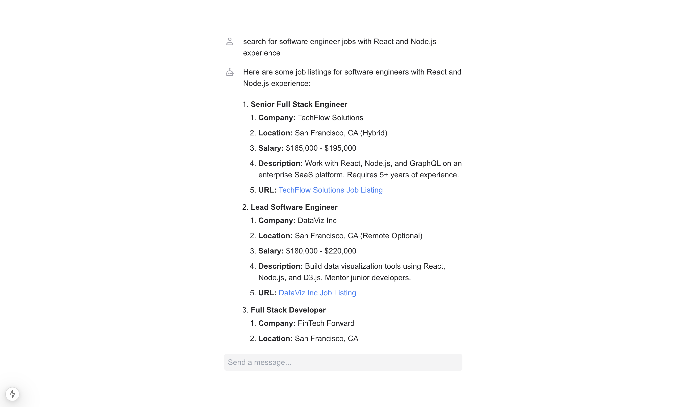

# Job Search Agent

This is the Next app for a job searching agent.

## Getting Started 🚀

1. Create a `.env.local` file in the project directory (next to `.env.example`) and add the following:

   ```
   OPENAI_API_KEY=                        # Get one at https://platform.openai.com
   ```

2. Install dependencies:

   ```
   pnpm install
   ```

3. Run the app:

   ```
   pnpm dev
   ```

4. Chat with the agent!
   
